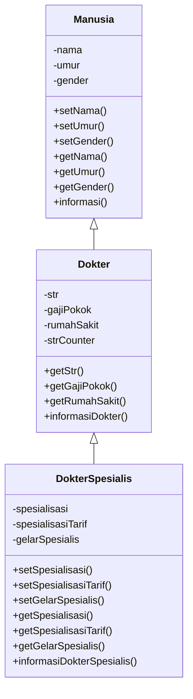
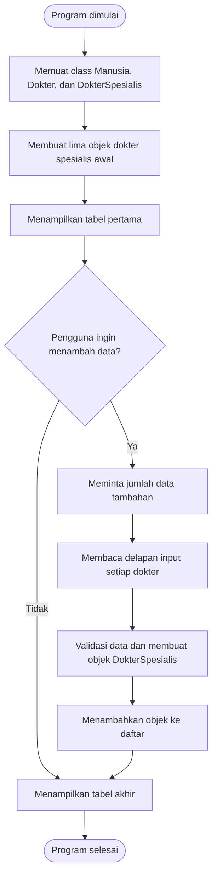

# TP2DPBO2526C2

Saya Renaldi Arlen Purba dengan NIM 2508106 mengerjakan Tugas Praktikum 2 pada Mata Kuliah Desain dan Pemrograman Berorientasi Objek (DPBO) untuk keberkahan-Nya maka saya tidak melakukan kecurangan seperti yang telah dispesifikasikan. Aamiin.

Program ini merupakan contoh **multilevel inheritance** dengan tema data dokter
spesialis. Program dibuat dalam empat bahasa pemrograman:

- Java sebagai implementasi utama
- Python sebagai implementasi command line
- C++ sebagai implementasi command line
- PHP sebagai implementasi website sederhana

Setiap versi memiliki tiga tingkat class:

`Manusia` -> `Dokter` -> `DokterSpesialis`

## Struktur Folder

```text
TP-02/
|-- javaa/
|   |-- Manusia.java
|   |-- Dokter.java
|   |-- DokterSpesialis.java
|   `-- Main.java
|-- pythonn/
|   |-- Manusia.py
|   |-- Dokter.py
|   |-- DokterSpesialis.py
|   `-- Main.py
|-- cpp/
|   |-- Manusia.cpp
|   |-- Dokter.cpp
|   |-- DokterSpesialis.cpp
|   `-- Main.cpp
`-- php/
	|-- Manusia.php
	|-- Dokter.php
	|-- DokterSpesialis.php
	|-- index.php
	`-- style.css
```

## Diagram Inheritance



Tanda `-` menunjukkan atribut private atau internal class, sedangkan tanda `+`
menunjukkan method yang dapat digunakan dari luar class. Nama atribut pada tiap
bahasa mengikuti gaya penulisan bahasanya, tetapi fungsi datanya sama.

## Penjelasan Class

### 1. Class `Manusia`

Class `Manusia` adalah parent class paling dasar. Class ini menyimpan identitas
umum yang dimiliki oleh semua manusia, termasuk dokter.

| Atribut | Tipe umum | Keterangan |
|---|---|---|
| `nama` | String/string | Nama manusia |
| `umur` | int/integer | Umur manusia |
| `gender` | String/string | Jenis kelamin manusia |

| Method | Fungsi |
|---|---|
| `Manusia(...)` | Constructor untuk membuat objek manusia |
| `setNama(...)` | Mengisi nama dan menolak nama kosong |
| `setUmur(...)` | Mengisi umur dan menolak umur kurang dari atau sama dengan nol |
| `setGender(...)` | Mengisi gender |
| `getNama()` | Mengambil nama |
| `getUmur()` | Mengambil umur |
| `getGender()` | Mengambil gender |
| `informasi()` | Menampilkan identitas dasar |

### 2. Class `Dokter`

Class `Dokter` mewarisi seluruh data dan method yang tersedia pada `Manusia`.
Class ini menambahkan data yang berhubungan dengan pekerjaan dokter.

| Atribut | Tipe umum | Keterangan |
|---|---|---|
| `str` | String/string | Nomor Surat Tanda Registrasi |
| `gaji_pokok` / `gajiPokok` | long/int | Gaji pokok dokter |
| `rumah_sakit` / `rumahSakit` | String/string | Tempat dokter bekerja |
| `str_counter` / `strCounter` | static int | Counter untuk membuat nomor STR otomatis |

| Method | Fungsi |
|---|---|
| `Dokter(...)` | Constructor dokter dan pemanggil constructor parent |
| `generateStrOtomatis()` | Membuat nomor STR baru secara otomatis |
| `setGajiPokok(...)` | Mengisi gaji pokok dan memvalidasi nilainya |
| `setRumahSakit(...)` | Mengisi rumah sakit |
| `getStr()` | Mengambil nomor STR |
| `getGajiPokok()` | Mengambil gaji pokok |
| `getRumahSakit()` | Mengambil rumah sakit |
| `informasiDokter()` | Menampilkan data manusia dan data dokter |

Counter STR bersifat static sehingga digunakan bersama oleh semua objek dokter.
Contoh nomor STR yang dihasilkan adalah `STR-1001`, `STR-1002`, dan seterusnya.

### 3. Class `DokterSpesialis`

Class `DokterSpesialis` mewarisi `Dokter`, sehingga secara tidak langsung juga
mewarisi `Manusia`. Class ini menambahkan data keahlian dokter.

| Atribut | Tipe umum | Keterangan |
|---|---|---|
| `spesialisasi` | String/string | Bidang keahlian dokter |
| `spesialisasi_tarif` / `spesialisasiTarif` | long/int | Tarif konsultasi spesialis |
| `gelar_spesialis` / `gelarSpesialis` | String/string | Gelar dokter spesialis |

| Method | Fungsi |
|---|---|
| `DokterSpesialis(...)` | Constructor dengan seluruh data manusia, dokter, dan spesialis |
| `setSpesialisasi(...)` | Mengisi spesialisasi dan menolak string kosong |
| `setSpesialisasiTarif(...)` | Mengisi tarif dan menolak nilai negatif |
| `setGelarSpesialis(...)` | Mengisi gelar dan menolak string kosong |
| `getSpesialisasi()` | Mengambil spesialisasi |
| `getSpesialisasiTarif()` | Mengambil tarif spesialisasi |
| `getGelarSpesialis()` | Mengambil gelar spesialis |
| `informasiDokterSpesialis()` | Menampilkan seluruh data dokter spesialis |

## Atribut dan Method Menurut Bahasa

| Konsep | Java | Python | C++ | PHP |
|---|---|---|---|---|
| Data private | `private` | `__nama` dan atribut double underscore | `private` | `private` |
| Pewarisan | `extends` | `class Dokter(Manusia)` | `: public Manusia` | `extends` |
| Constructor parent | `super(...)` | `super().__init__(...)` | initializer `: Manusia(...)` | `parent::__construct(...)` |
| Counter static | `static int` | atribut class | `inline static int` | `private static int` |
| Tabel | Terminal | Terminal | Terminal | HTML di browser |

## Alur Program



### Urutan Input Dokter Tambahan

Untuk setiap dokter tambahan, data dimasukkan dengan urutan berikut:

1. Nama
2. Umur
3. Gender
4. Gaji pokok
5. Rumah sakit
6. Spesialisasi
7. Tarif spesialisasi
8. Gelar spesialis

Pada versi Python dan C++, input dibaca melalui terminal. Pada versi PHP,
input dimasukkan melalui form website.

## Cara Kerja Tabel Dinamis

### Python, C++, dan Java

1. Header tabel disiapkan
2. Data objek diubah menjadi kumpulan nilai string
3. Program menghitung panjang header dan isi setiap kolom
4. Panjang terbesar digunakan sebagai lebar kolom
5. Border dibuat berdasarkan lebar tersebut
6. Header dan seluruh data dicetak dengan format rata kiri

### PHP

PHP tidak membuat border tabel melalui perhitungan string seperti versi terminal.
PHP membuat tabel HTML dengan elemen `table`, `thead`, `tbody`, `tr`, `th`, dan
`td`. Tampilan tabel diatur oleh `style.css`, sedangkan data dokter ditampilkan
melalui perulangan `foreach`.

PHP juga menggunakan session agar data tambahan tetap tersedia selama session
browser masih aktif. Tombol `Kembalikan data awal` menghapus data tambahan dari
session.

## Cara Menjalankan

Jalankan semua perintah dari folder utama proyek `TP-02`.

### Java

```powershell
cd javaa
javac *.java
cd ..
java javaa.Main
```

### Python

```powershell
python pythonn/Main.py
```

### C++

```powershell
g++ -std=c++17 cpp/Main.cpp -o cpp/main.exe
.\cpp\main.exe
```

### PHP

PHP bisa dijalankan menggunakan server PHP, bukan Live Server

```powershell
php -S localhost:8000 -t php
```

Kemudian buka alamat berikut di browser:

```text
http://localhost:8000
```
